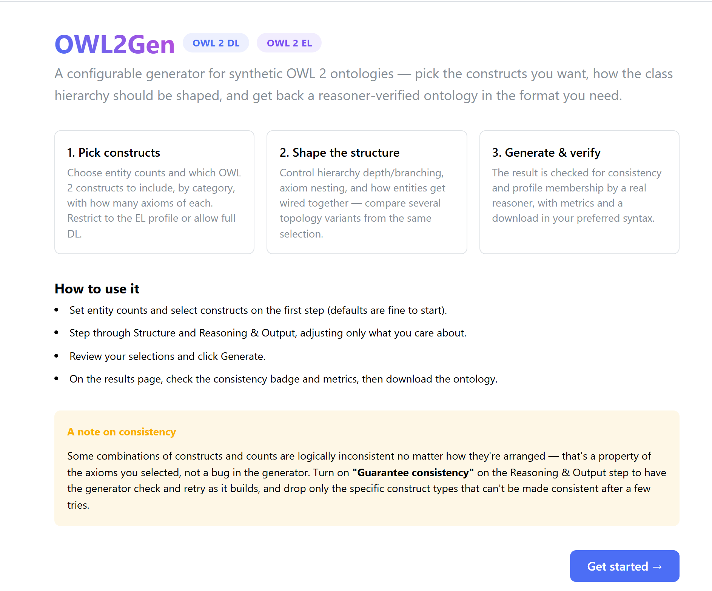
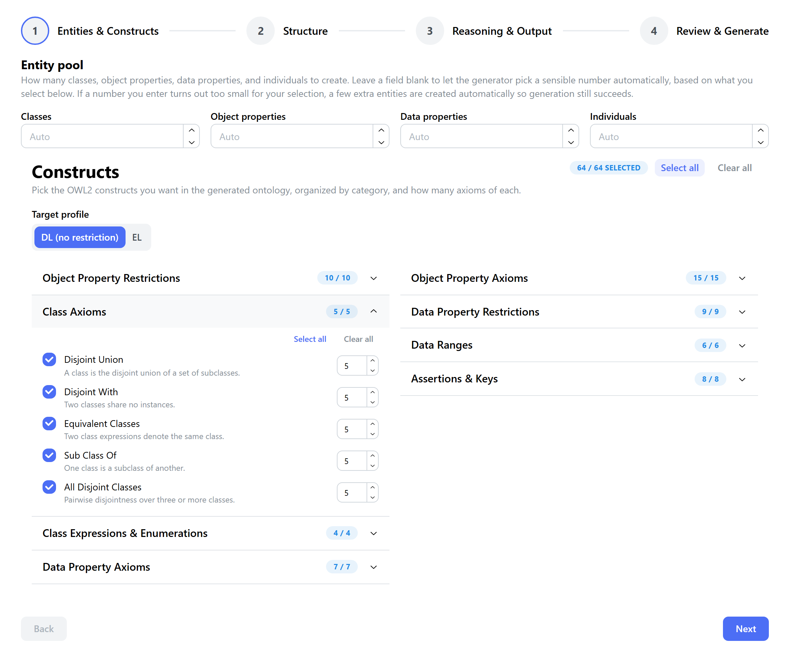
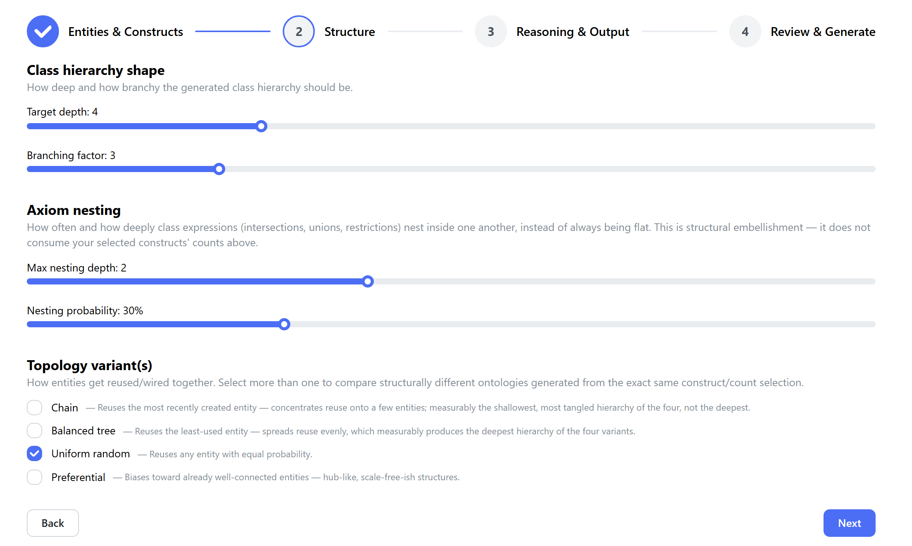
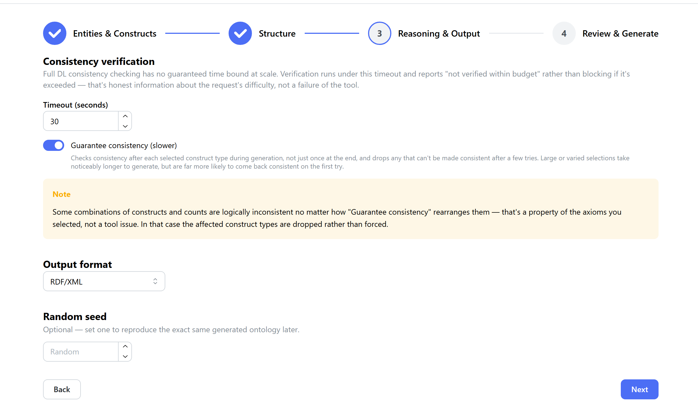
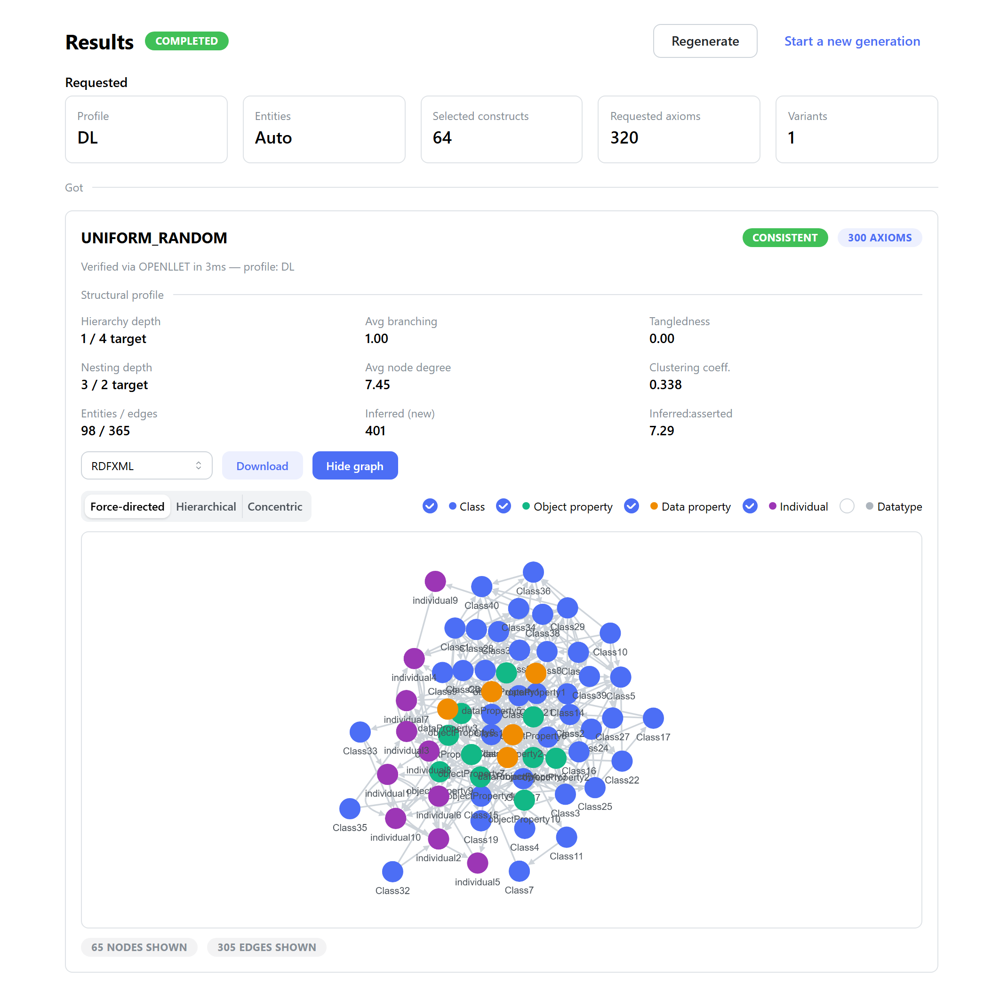

# OWL2Gen-DL

A configurable OWL 2 ontology generator for benchmarking Description Logic (DL) reasoners. Users pick OWL2
constructs and how many axioms of each they want; the tool generates a domain-agnostic ontology exercising
exactly that selection, verifies its consistency, and reports structural quality metrics (nesting depth,
hierarchy shape, entity connectivity, inferred-vs-asserted axioms) so generated ontologies can be shown to
have genuine structural complexity rather than being repetitive or arbitrary.

This is a from-scratch rebuild of an earlier version of the tool, focused on a cleaner architecture (a
construct-generator registry instead of reflection dispatch, per-request generation state instead of shared
statics, a pluggable topology/attachment strategy layer, and a reasoning layer that degrades gracefully at
scale instead of blocking indefinitely) and a lighter, decoupled build (no embedded frontend build inside the
backend build).

**Scope for this build**: DL-reasoner benchmarking only, domain-agnostic from-scratch generation only. Support
for neuro-symbolic reasoners and schema-based (seed-from-existing-TBox) generation are deferred to future
work.

## Contents

- [Screenshots](#screenshots)
- [How it works](#how-it-works)
- [Structure](#structure)
- [Running](#running)
- [Configuration](#configuration)
- [Troubleshooting](#troubleshooting)
- [Deferred / future work](#deferred--future-work)

## Screenshots

**Landing page** — overview of the three-step workflow.



**Step 1 – Entities & Constructs** — set entity counts, choose the target profile (DL or EL) and pick constructs by category with per-construct axiom counts.



**Step 2 – Structure** — class hierarchy depth/branching, axiom nesting, and the topology variant(s) to compare.



**Step 3 – Reasoning & Output** — consistency-check timeout, "Guarantee consistency" mode, output format and random seed.



**Results** — consistency badge, structural profile metrics, download in the chosen syntax and an interactive graph of the generated ontology.



## How it works

1. `GET /api/catalog` serves the full OWL2 construct catalog (64 constructs across 8 categories) from one
   enum (`ConstructId`) — the frontend has no hardcoded construct list; it renders whatever the backend
   advertises.
2. `POST /api/generations` takes entity counts, a construct → count map, structural parameters (hierarchy
   depth/branching, axiom nesting depth/probability), one or more topology variants to compare, and a
   reasoning timeout. It creates a job and returns immediately (`202 Accepted`) — generation runs
   asynchronously per variant. The hierarchy and nesting parameters are **targets, not guarantees**: hierarchy
   depth/branching can only be realized through however many `SUB_CLASS_OF` axioms are actually requested in
   the construct/count map, so a high target paired with a low `SUB_CLASS_OF` count will fall well short of
   it — the results view reports achieved-vs-target for both.
3. For each variant: entity pools are seeded, all 64 construct generators build real OWL API axioms by
   drawing from those pools (which entity gets reused is decided by the variant's **attachment strategy** —
   `UNIFORM_RANDOM`, `PREFERENTIAL`, `CHAIN`, or `BALANCED_TREE` — this is what makes "variants" produce
   genuinely different ontology shapes from the same construct/count selection, not just shuffled axioms), a
   constraint guard blocks a small set of known local logical clashes as axioms are added, the ontology is
   verified for consistency via Openllet under a hard time budget (never blocks indefinitely — reports
   `NOT_VERIFIED_TIMEOUT` rather than hanging), and structural quality metrics are computed.
4. `GET /api/generations/{id}` polls job/variant status; `GET /api/generations/{id}/variants/{variant}/ontology`
   downloads the result in RDF/XML, Turtle, OWL/XML, Manchester, or Functional syntax.

## Structure

```
backend/   Java 17, Spring Boot 3.3, OWL API, Openllet. REST API for generation, reasoning, and metrics.
frontend/  Vite + React + TypeScript, Mantine UI. Construct picker, structural controls, results dashboard.
docs/      Architecture and API contract notes.
```

Backend package map (`backend/src/main/java/com/owl2gendl/`):

| Package | Responsibility |
|---|---|
| `catalog` | The construct catalog (`ConstructId`, `ConstructCategory`) — single source of truth |
| `generator` | One `ConstructGenerator` per construct, registered by `ConstructGeneratorRegistry` (fails startup if any construct is missing a generator) |
| `pool` | Reuse-tracked entity pools (classes, properties, individuals, datatypes) |
| `topology` | Attachment strategies, hierarchy shape, axiom nesting — the structural-parameter layer |
| `constraint` | Construction-time clash avoidance (`ConstraintTracker` + a declarative rule registry) |
| `reasoning` | OWL2 profile checking, timeout-bounded consistency verification |
| `metrics` | Structural/graph/reasoning quality metrics |
| `context` | Per-request generation state (`GenerationContext`) — no shared mutable statics |
| `orchestration` | Ties the above together into one generation run per variant |
| `job` | Async job model, in-memory store with TTL eviction |
| `api` | REST controllers, DTOs, request validation, global error handling |

## Running

### Requirements

- **JDK 17+**
- **Node 20.19+ / 22.12+** (the frontend's Vite/TS toolchain requires this; older Node versions will hit
  `npm warn EBADENGINE` and may fail to build)
- No system-wide Maven install is required — `backend/mvnw`/`mvnw.cmd` bootstrap their own. **Known caveat**:
  on Windows, if your user profile path contains a space (e.g. `C:\Users\Jane Doe\`), the wrapper's bootstrap
  script can fail to launch. If that happens, install Maven directly (e.g. `winget install Apache.Maven`, or
  download and extract the binary distribution) and use `mvn` instead of `./mvnw`.

### Backend

```
cd backend
./mvnw spring-boot:run
```

Serves the API on `http://localhost:8080`. OpenAPI docs at `/v3/api-docs`, Swagger UI at `/swagger-ui.html`.

Run tests with `./mvnw test`.

### Frontend

```
cd frontend
npm install
npm run dev
```

Serves the dev UI on `http://localhost:5173`, proxying `/api` requests to the backend. Build for production
with `npm run build`.

## Configuration

Deployment-level tuning lives in `backend/src/main/resources/application.yml` under `owl2gendl.generation` —
none of it needs a code change or recompile, just an overridden property (env var, `-D` flag, or an
environment-specific Spring profile):

| Property | Default | Controls |
|---|---|---|
| `max-batch-retry-attempts` | 3 | Guarantee Consistency: retries for a single construct-type batch mid-generation |
| `intermediate-check-timeout-seconds` | 3 | Guarantee Consistency: per-batch reasoner check timeout (fails open on timeout) |
| `default-final-verification-timeout-seconds` | 30 | Final consistency check timeout, when a request doesn't set its own |
| `max-inconsistent-attempts` | 3 | Whole-variant regeneration retries (new seed) if final verification is INCONSISTENT |
| `default-classes` / `default-object-properties` / `default-data-properties` / `default-individuals` | 20 / 6 / 3 / 10 | Entity pool sizes when a request leaves them unset |
| `default-hierarchy-target-depth` / `default-hierarchy-branching-factor` | 4 / 3 | Hierarchy shape (`h`) when a request's `structure` is omitted or partial |
| `default-nesting-max-depth` / `default-nesting-probability` | 2 / 0.3 | Axiom nesting (`x`) when a request's `structure` is omitted or partial |

## Troubleshooting

- **Frontend can't reach the backend / "Could not load construct catalog"**: confirm the backend is running
  on port 8080 and `frontend/vite.config.ts`'s dev proxy target matches.
- **`NoClassDefFoundError` involving `org.jgrapht`**: if you add a JGraphT dependency back to the backend for
  any reason, know that `openllet-core` transitively needs the old (pre-1.2) `jgrapht-core` package layout for
  its own taxonomy cycle detection, which conflicts with any modern JGraphT version on the same classpath.
  The graph metrics in `metrics/EntityRelationGraphBuilder`/`GraphMetricsCalculator` are deliberately
  hand-rolled with plain Java collections instead, specifically to avoid this.
- **A job stays at `RUNNING` forever**: check the backend log for an `Error` (not just an `Exception`) —
  `GenerationJobRunner` catches `Throwable` at both the per-variant and per-job level specifically because a
  classpath conflict once surfaced as a `NoClassDefFoundError`, which a `catch (Exception e)` does not catch.
- **Generation request rejected with 400**: the response body is `{"message": "...", "details": [...]}` —
  common causes are an unknown construct/variant name, a request whose total requested axioms exceed the
  cap (`RequestValidator.MAX_TOTAL_REQUESTED_AXIOMS`, currently 5000 per request), or a structural parameter
  outside its validated range.

## Deferred / future work

- **Neuro-symbolic reasoner support**: EL++-restricted construct subset, generation driven by which EL
  completion rule/reasoning pattern should be exercisable, dataset-style output (normalized axioms, train/
  test/valid splits) rather than a single ontology file.
- **Schema-based generation**: seed from a real domain TBox (bucket its axioms by construct, scale via reuse/
  renaming) as a second generation pipeline alongside the current from-scratch one.
- **`ChainAttachment` refinement**: currently always reuses the single most-recently-minted entity across
  every pick, which collapses reuse onto one entity rather than forming genuinely sequential chains (A→B→C→D).
  Works correctly (no crash, produces a valid consistent ontology, and is measurably different from the other
  three variants) but doesn't yet produce the "deep chain" shape its name implies.
- A faster reasoning tier (ELK was evaluated and dropped — see `reasoning/ReasonerTier`'s javadoc; a future
  option is invoking the Konclude binary as an external process).
